[comment]: # "This is the standard layout for the project, but you can clean this and use your own template"

<h1 align="center">Objectively Measure Player Performance on Olympic  Weightlifting</h1>

#### Team

- E/15/154, Chamin Jayasooriya, [email](mailto:e15154@eng.pdn.ac.lk)
- E/15/179, Anandi Karunaratne, [email](mailto:anandi.karunaratne@gmail.com )

#### Supervisors

- Dr. Rajitha Navarathna, [email](mailto:rajithae03@gmail.com)
- Mr. Sampath Deegalla, [email](mailto:sampath@eng.pdn.ac.lk )

#### Table of content

1. [Abstract](#abstract)
2. [Related works](#related-works)
3. [Methodology](#methodology)
4. [Experiment Setup and Implementation](#experiment-setup-and-implementation)
5. [Results and Analysis](#results-and-analysis)
6. [Conclusion and Future Work](#conclusion)
7. [Links](#links)

---

## Abstract
This project introduces a novel method to measure the quality of the actions performed in Olympic weightlifting using human action recognition in videos. Human action recognition is a well-studied problem in computer vision and on the other hand action quality assessment is researched and experimented comparatively low. This is due to the lack of datasets that can be used to assess the quality of actions. In this research, we introduce a method to assess player techniques in weightlifting by using skeleton-based human action recognition. Furthermore, we introduce a new video dataset for action recognition in weightlifting which is annotated to frame level. We intended to develop a viable automated scoring system through action recognition that would be beneficial in the sports industry. 

## Related works

#####  Action Quality Analysis in Weightlifting

A very limited amount of work has been conducted on action quality analysis in weightlifting. Chatzitofis et al. (2013) has analyzed the biomechanics of human body and how it is applied to weightlifting. They have also extracted the data that is important to a weightlifting coach. These data includes the position, the angle, and the velocity of the weightlifting bar, the initial angle of the athlete’s knee, and the start time and the end time of the lift. For this, they have used a kinetic sensor to get depth data.

##### Skeleton based Action Classification
Classifying Actions with a Skeleton based Approach has captured the attention excessively in the past years.

Li et al. (2019) introduces a new module named, A-link inference module which is an encoder-decoder structure. It can capture richer dependencies that current models might miss since they only capture local physical dependencies among joints. A-link inference model captures two main dependencies. 1. Action links, which are action-specific dependencies; and 2. Structural links. Combining these two, actional-structural graph convolution networks (AS-GCN) is proposed. 

Skeleton based action recognition has difficulties such as limited expressive power and generalization. Yan et al. (2018) addresses this problem by introducing a novel model of dynamic skeletons called Spatial-Temporal Graph Convolutional Networks (ST-GCN). This model is able to learn spatio-temporal patterns automatically and capable of generalization. This is validated on Kinetics and NTU-RGBD datasets.

## Methodology

##### Dataset

Since there are no existing weightlifting datasets, we have created our own dataset consisting of weightlifting video clips.

For our dataset, videos were collected from the official Olympic YouTube channel. The selected videos include both men and women categories and both snatch and clean and jerk categories. The long video footages were trimmed down so that they only contain weightlifting events where only the player and the barbell is seen. Then we annotated the actions in a frequency of 5 fps.

1. Action Classes

   As shown in Table I we can identify 11 action classes in weightlifting. There are 1570 of total video frames in the dataset containing all the actions as described in the Table II.

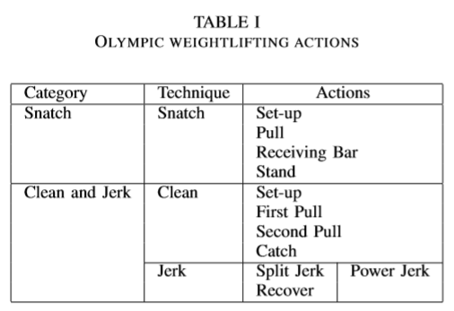

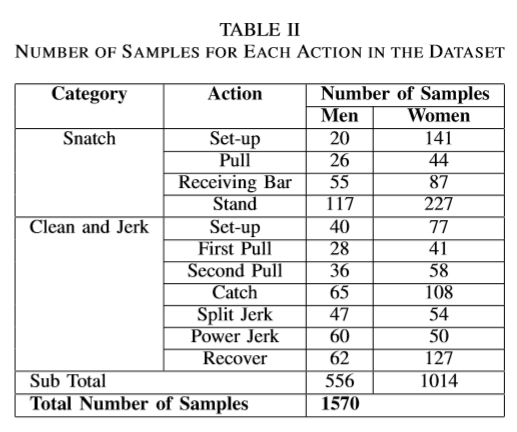

2. Testing Data

   As for the testing purposes, we have used videos specifically with the medalists of different weight categories in 2016 Olympics as shown in the Table III. 

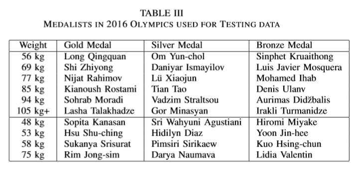

By using these data we have assumed that their techniques are more accurate. Hence we have used them for deriving optimal values for initial knee angle, bar angle  which are used for our scoring model.

##### Approach

As we discussed earlier, we used the skeleton based approach to recognize the actions.

The following figure shows the basic workflow of extracting and identifying actions done by humans in a video. For this, we have identified a suitable framework which estimates the poses of humans and represent using a skeleton showing joints of the human body. This framework is Openpose (references: Cao et al. (2019), Simon et al. (2017), Cao et al. (2019), Wei et al. (2016), [Feiyu Chen](https://github.com/felixchenfy/Realtime-Action-Recognition)). It was initially developed by researchers at Carnegie Mellon University. We have trained this model with our dataset in order to identify and classify actions.

<figure>
  
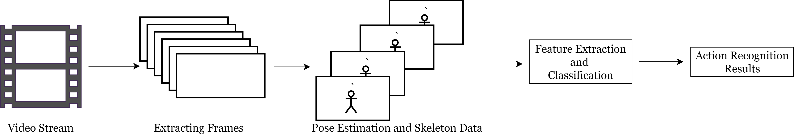

  <figcaption>
Fig.1 - Action Recognition Workflow
</figcaption>
</figure>

After pose estimation is done, the features are extracted from the skeleton. 

We have identified that the position, the angle, and the velocity of the weightlifting bar, the initial angle of the athlete’s knee as well as the start time and the end time of the attempt are important for a weightlifting coach (references: [Weightlifting Equipment and History - Olympic Sport History](https://www.olympic.org/weightlifting-equipment-and-history), Chatzitofis et al. (2013)). We have used the coordinates of the joints in the 2D image plane that are obtained from our model to calculate those information. The joints that are identifiable are shown in the below figure.

<figure>
  
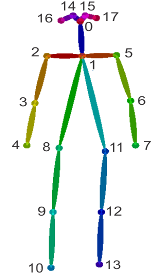

  <figcaption>
Fig.2 - Joints identified using Openpose
</figcaption>
</figure>

In simple terms, a weightlifting attempt is considered as a successful lift if a lifter can lift the bar above him and keep it balanced for a time. Therefore tracking the position, angle, and the velocity is important for a coach.

Usually a player balances the bar symmetrically when he is lifting. Therefore we can assume that the player's hands are at the same length from the center of the bar. Therefore, weightlifting bar position is calculated using joint 4 and joint 7.

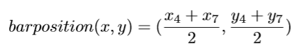

The angle between the bar and horizontal axis is important, because if the angle is too wide, it is harder for the player to balance the bar and it is likely the attempt will be unsuccessful. For this calculation we will be using the same joints we used for position calculation; 4 and 7.

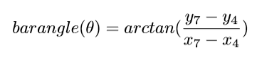

Velocity of the bar is another important factor for a coach. When a player lifts a bar, there is work (<i>W</i>) being done. (<i>W</i>) equals to <i>F.d</i>, where <i>F</i> is force given, and <i>d</i> is the distance moved. And as we know power (<i>P</i>) equals <i>W/t</i> where <i>t</i> is the time. Which gives us the following,

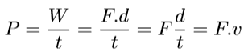

where <i>v</i> is the velocity. While lifting, a player must give power as needed, not more or less. For velocity calculation, we will consider the bar positions of the current frame and the previous frame.

The knee angle in the initial set up position is crucially important in weightlifting, because the success of the lift will depend on that. To calculate the initial knee angle, we will be using the coordinates of 11, 12, and 13 joints.

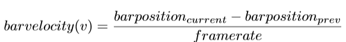

Here, <b>a</b> is the vector passing through joint 11 and 12, and <b>b</b> is the vector passing though joint 12 and 13.

We propose a scoring model where we can get a proper understanding of the accuracy of the techniques of the player. We assigned weights for the features we have extracted based on their importance and evaluate the accuracy of their action.

For this, we followed the pseudo code described below in Algorithm.

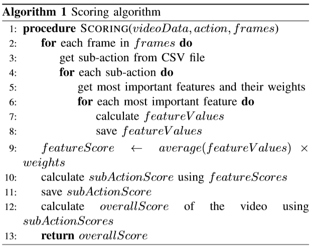

And the expected structure of the result is as follows.
* Overall score for the action
* Individual scores relevant to sub actions
* Details of the score calculation (which and how features affected to score

##### Implementation

We set up the environment on a high-performance server that has an Intel Xeon E5-1630 v3 CPU and an NVIDIA GK180GL [Tesla K40c] GPU  to train the action recognition model.

As we discussed earlier, for skeleton detection, Openpose framework was used, which is the Tensorflow variant of the initial Openpose framework. As mentioned, the skeleton detection library is built upon Tensorflow. For drawing skeletons and bounding boxes around human figures, OpenCV and Matplotlib libraries were used.

The Openpose framework provides two models for skeleton detection; CMU and Mobilenet-thin. CMU model detects skeletons more accurately but at a slower speed when it is compared to Mobilenet-thin. For our experiments, we used the CMU model. The image (pre-processed video frames) resolution is 656x368 pixels. (Higher the input images' resolution, higher the accuracy of the skeleton detection.)

Then the features were extracted and pre-processed, and then the classification was done by MLPClassifier from Scikit-learn which is a neural network model. After this step, we have recognized actions and skeleton data of the player for each frame. Using these two information, we calculated angles and other required features for the technique evaluation algorithm.

With those required parameters calculated, the action quality assessment can be done.

## Experiment Setup and Implementation

For our final experiments and demonstrations, we used Openpose framework. In the first setup, Openpose is used to get the positions of the joints. Each person is tracked by calculating the Euclidean distance between the joints of two skeletons and matching two skeletons. Missing joints are filled using the joints' relative position in the previous frame. Noise was added to the joint positions to try to augment data. A window size of 0.5s (5 frames) was used to extract features. The features of Body velocity, Normalized joint positions, and joint velocities were extracted. Then PCA was applied to reduce the feature dimension to 80. After that, it was classified by DNN of 3 layers of 50x50x50.

After that, recognized actions for each frame is used to evaluate player techniques. Python, OpenCV and other helper libraries can be used to achieve this. Once the action for each frame of the video is identified, we evaluated techniques according to those identified actions. For example, if it is the initial position then we do not want to evaluate the player's arms angles. In that position, we would rather need to know about knee angles. Therefore, we programmed our scoring algorithm in such a way where player's technique is evaluated relevant to the current action. As mentioned in the Algorithm, we estimated a score for the quality of the action. If the player performs actions accurately in pre-defined techniquewise, then the player will get a higher score. At the end of the video, the player will get an overall score which is the weighted average of the scores earned for each sub-action.

#### Data manipulation and Testing

The video datasets were manipulated mainly by FFMPEG tool and OpenCV framework. For the training purposes, videos were collected from YouTube and some of the data were already collected by previous authors. The video data is preprocessed by trimming the videos (removing unnecessary parts of the video that are irrelevant to the target action) by using FFMPEG.

Then the trimmed videos were converted into sequences of images using OpenCV and other python libraries such as NumPy, itertools, simplejson, etc. After that, for skeleton detection, Openpose framework was used, which is the Tensorflow variant of the initial Openpose framework. As mentioned, the skeleton detection library is built upon Tensorflow. For drawing skeletons and bounding boxes around human figures, OpenCV and Matplotlib libraries were used.

The Openpose framework provides two models for skeleton detection; CMU and Mobilenet-thin. CMU model detects skeletons more accurately but at a slower speed when it is compared to Mobilenet-thin. For our experiments, we used the CMU model. The image (preprocessed video frames) resolution is 656x368 pixels. (Higher the input images' resolution, higher the accuracy of the skeleton detection.)

Then the features were extracted using Numpy and then the classification was done by MLPClassifier from Scikit-learn which is a neural network model. Then again the sequence of images was converted into the output video with labeled actions by OpenCV, Numpy, and other Python libraries.

#### Pitfalls and workarounds
Since we have been working on a CLI environment, getting video inputs and outputs to the local GUI cannot be done directly. Because of this, we could not test these frameworks using a webcam for live-action recognition. To overcome this issue, we have used Google cloud APIs (Drive API and YouTube Data API) and SSH, SCP protocols to manipulate data on the server.

Further, the OpenPose framework does not perform well with the videos that include truncated and occluded human figures, rapid variations of camera angles, scale of the viewpoint and colour spectrum, brightness etc. Therefore to avoid erroneous results that would happen due to such reasons, we created our Weightlifting Dataset in which the video data does not have such properties.

Since we do not estimate the angles of body joints in 3-dimensional space, the calculated angles may vary from the real values. But what we have done is using those angles to estimate a score which is a reasonable interpretation of the estimated angles. People can use that scores to evaluate players rather than raw angle values. To calculate the scores, we followed an experimental approach where we had to change parameters of the scoring algorithm many times to obtain an acceptable values for the scores.

## Results and Analysis

#### Action Recognition Results
Results of the action recognition model are shown in below Figure 3 and Table IV. We can see that the accuracy on test data is over 93\%. This is due to the video dataset we chose for this task, which contains favourable properties for our action recognition model. By choosing training data in which human body occlusion, truncation are very minimum and other properties such as uniform scale, uniform brightness/contrast distribution, the human skeleton detection accuracy must have been improved. The dataset contains single person video frames and the background clutter is almost none.

<figure>
  
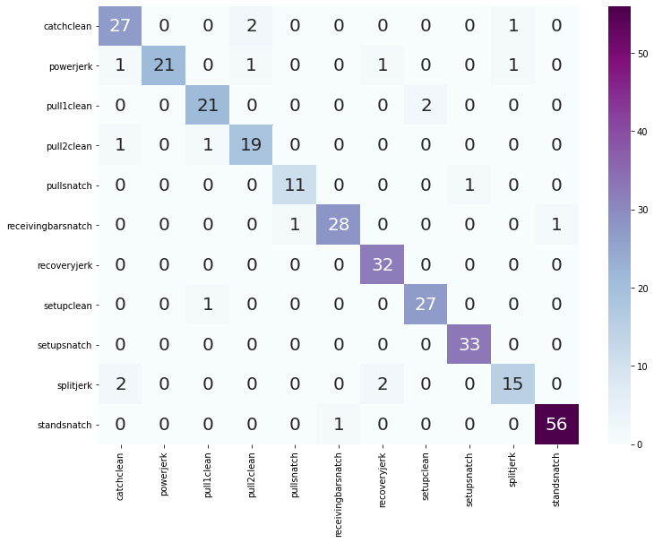

  <figcaption>
Fig.3 - Confusion Matrix for the Results of the Action Recognition Model
</figcaption>
</figure>
 
<figure>
  

  
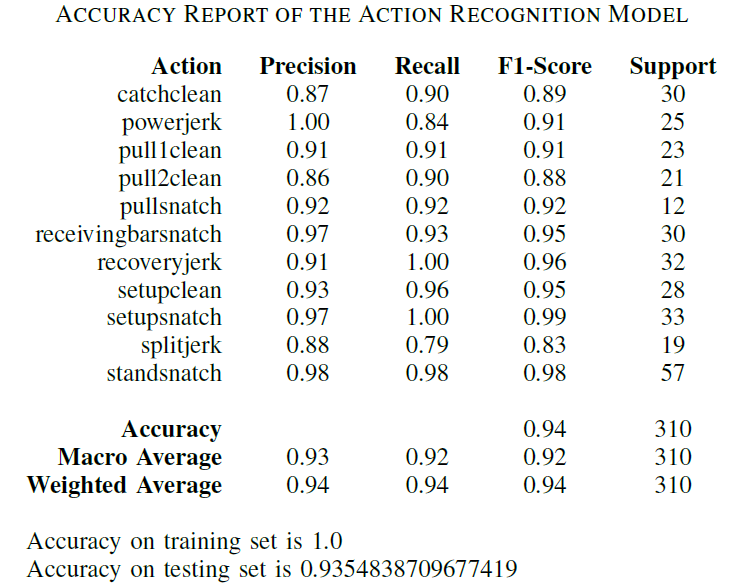

  <figcaption>
Table IV - ACCURACY REPORT OF THE ACTION RECOGNITION MODEL
</figcaption>
</figure>

#### Action Quality Assessment Results
According to the algorithm we described in the above algorithm we assessed the whole lift and each sub-action. To get optimal values for comparison, we considered a video set of Olympic champions of the 2016 Olympics as the baseline data as shown in Table VI. Table V  includes the player names with respect to the video sample number. Results obtained from those videos are shown in Figure .

<figure>
  

  
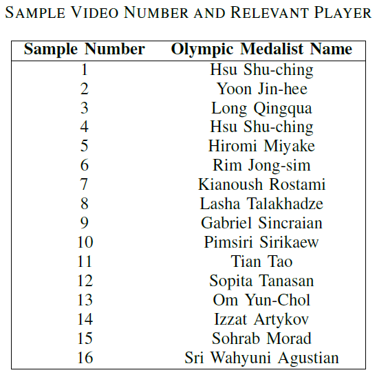

  <figcaption>
Table V - Sample Video Number and Relevant Player
</figcaption>
</figure>
<figure>
  

  
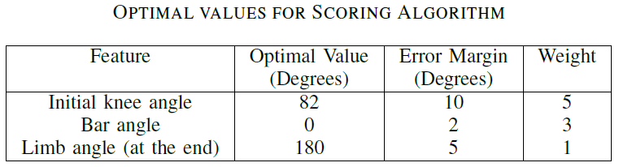

  <figcaption>
Table VI - Optimal values for Scoring Algorithm
</figcaption>
</figure>
<figure>
  
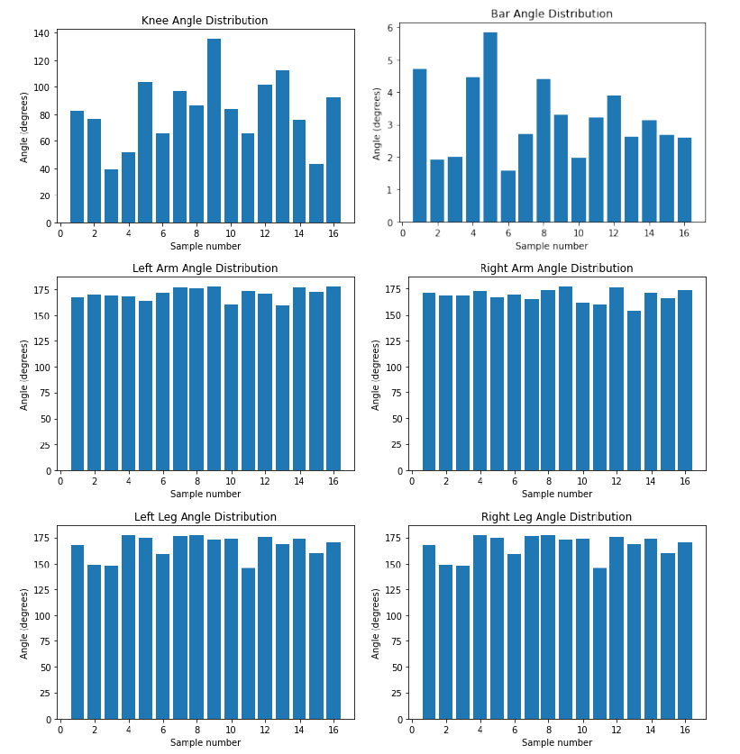

  <figcaption>
Fig.4 - Distribution of Angles in Olympic Medalists’ Videos Which Were Used to Determine Optimal Values for Scoring Algorithm
</figcaption>
</figure>

#### Scoring Algorithm
Using the values in Table VI we updated our scoring algorithm, and we applied it to calculate the scores of our previous dataset.
<figure>
  
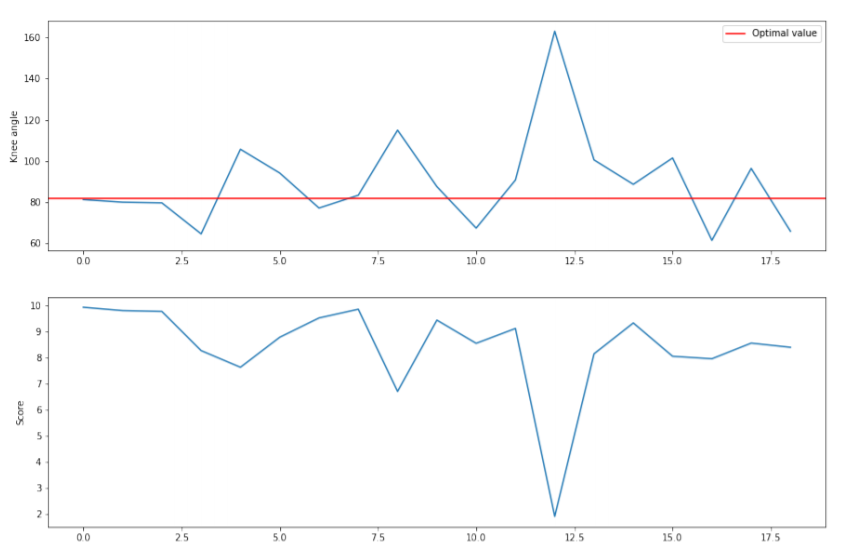

  <figcaption>
Fig.5 - Initial knee angle and Obtained score distribution
</figcaption>
</figure>

<figure>
  

  <figcaption>
Fig.6 - Bar angle and Obtained score distribution
</figcaption>
</figure>

In Figures 5 and 6 we can see how the score decreases with the deviation from the optimal value.

The comparison of the scores of Olympic medalists' videos and our dataset is given in Figure 7 and Figure 8.
<figure>
  
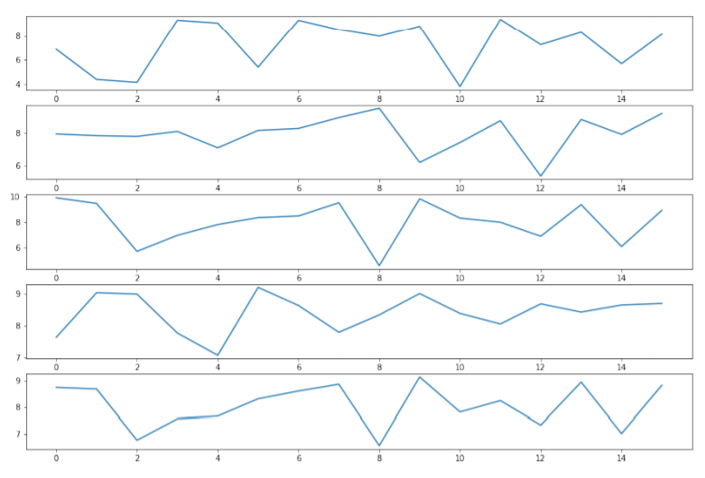

  <figcaption>
Fig.7 - Leg, Arm, Knee angle, Bar angle, and Overall scores of Olympic medalists
</figcaption>
</figure>

<figure>
  
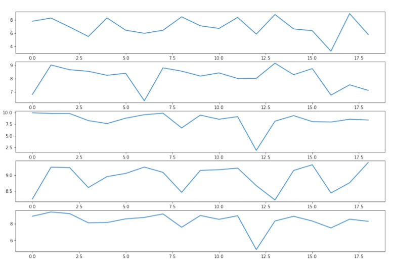

  <figcaption>
Fig.8 - Leg, Arm, Knee angle, Bar angle, and Overall scores of the dataset
</figcaption>
</figure>

By analyzing the overall scores for the weightlifting videos, we can see that our scoring algorithm has assigned scores for players' actions as we expected with defined optimal values and weights for each sub-action. One can always re-configure the scoring algorithm values to determine what is best for their own evaluation. Here we have attempted to demonstrate the capability of our proposed method to evaluate players based on their action quality.

As we have already mentioned, for a coach the velocity of lifting the bar of each player is important. We have used a graphical way to show the coach how the bar moves vertically, with respect to the frames in the video footage. (Figure 9 and 10)
<figure>
  

  <figcaption>
Fig.9 - Bar movement - Snatch
</figcaption>
</figure>

<figure>
  

  <figcaption>
Fig.10 - Bar movement - Clean and Jerk
</figcaption>
</figure>

Figure 11 shows the differences between the bar movements of the snatch lift and the clean and jerk lift. 
Figure 12 compares the bar movements of two different Olympic players. The idea here is for a coach to get a general idea about the player. Therefore we did not focus on converting the data into metric units. Sport-persons can compare the bar movement with other players or with their previous lifts to improve their lifts. Hence this can be used as an assistive tool for training.
<figure>
  
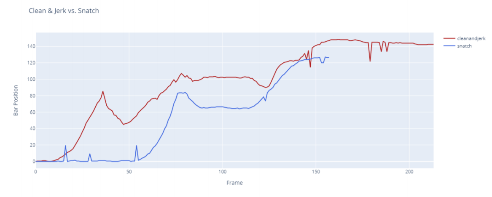

  <figcaption>
Fig.11 - Comparison of bar movement - Snatch and Clean and Jerk
</figcaption>
</figure>

<figure>
  

  <figcaption>
Fig.12 - Comparison of bar movement - Snatch Men 94 kg and Snatch women 75 kg
</figcaption>
</figure>

<video width="320" height="240" controls>
  <source src="media/demo.avi" type="video/avi">
  Your browser does not support the video tag.
</video>

## Conclusion and Future Work

We have introduced a way to analyze the quality of a weightlifting player performance using just a video footage as the input. For this purpose we have identified the actions performed, extracted the required features for the relevant actions, and evaluated the quality of the action using those features. 

We have used Openpose, which is a 2D pose estimation model using skeleton based approach as our model. The model was trained using a weightlifting dataset created by us.

The parameters for automatic action quality assessment algorithm can be further fine-tuned by following an empirical approach by involving sportspeople.

Our intention was to develop a solution that can be used by anyone with a digital camera. Hence, the calculated angles were not accurate for direct usage. Another approach to address this problem is to use a 3D pose estimation model or to simultaneously process two videos obtained from the front angle and side angle, but that would limit the usage from the regular users.

## Links

- [Project Repository](https://github.com/cepdnaclk/e15-4yp-sports-action-recognition )
- [Project Page](https://cepdnaclk.github.io/e15-4yp-sports-action-recognition )
- [Department of Computer Engineering](http://www.ce.pdn.ac.lk/)
- [University of Peradeniya](https://eng.pdn.ac.lk/)

[//]: # "Please refer this to learn more about Markdown syntax"
[//]: # "https://github.com/adam-p/markdown-here/wiki/Markdown-Cheatsheet"
